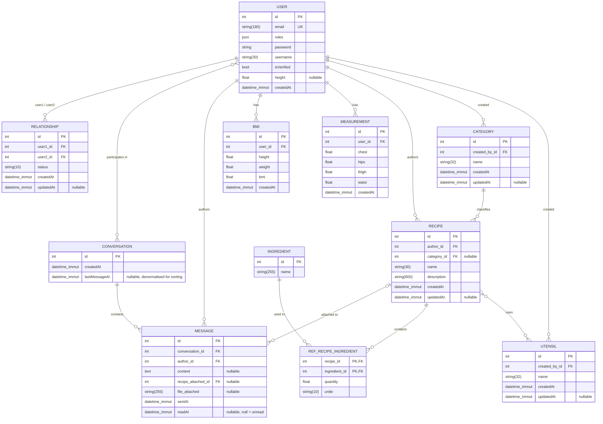

# MesApplisHF

A Symfony 7.4 application powering the **HF apps portal**.

It hosts a collection of small personal apps:

- **MonPoids** — a weight & body-measurement tracker with a BMI calculator (private to each user).
- **MaCuisine** — a small social network for sharing recipes (with ingredients, ustensiles, categories).
- **Friends** — a social layer shared by both: search for people, send and accept friend
  requests, and chat in real time (see [Friends & chat](#friends--chat)).

Each sub-app exposes both a regular user area and an `/admin/...` section gated by `ROLE_ADMIN`.

📚 **[Documentation](https://eeckhoutremi.github.io/MesApplisHF)** — generated with phpDocumentor.

> Status: early development.

---

## Tech stack

| Layer                  | Choice                                      |
| ---------------------- | ------------------------------------------- |
| Language               | PHP **8.4+**                                |
| Framework              | Symfony **7.4.\***                          |
| Runtime                | `symfony/runtime`                           |
| Dependency             | Composer (managed via Flex)                 |
| Autoloading            | PSR-4 — `App\` → `src/`                    |
| Database               | PostgreSQL via Doctrine ORM **3** + migrations |
| Front-end              | Twig, Bootstrap 5.3, `symfony/asset-mapper` (no build step) |
| Realtime               | [Mercure](https://mercure.rocks) (SSE) via `symfony/mercure-bundle` |
| Transactional e-mail   | [Resend](https://resend.com) via `symfony/resend-mailer` |
| Images                 | `liip/imagine-bundle` (AVIF / WebP / PNG / JPEG variants) |
| Tests                  | PHPUnit **13** — Unit, Functional, E2E suites |
| Static analysis        | PHPStan level 6, PHP_CodeSniffer (PSR-12)   |
| Deployment             | Docker (multi-stage `Dockerfile`, FrankenPHP) |

## Requirements

- PHP **>= 8.4** with `ext-ctype`, `ext-iconv`, `intl` and `pdo_pgsql`
- **PostgreSQL** (the app uses `pdo_pgsql`)
- [Composer](https://getcomposer.org/) 2.x
- (Optional) the [Symfony CLI](https://symfony.com/download) for the local web server
- (Optional) Docker — the production image is built from the multi-stage `Dockerfile`
- (Optional) a [Mercure](https://mercure.rocks) hub for live chat updates — the app runs
  fine without one, see [Local development](#local-development)

## Getting started

```bash
# 1. Clone
git clone <repo-url> MesApplisHF
cd MesApplisHF

# 2. Install dependencies
composer install

# 3. Configure environment
cp .env .env.local      # then set DATABASE_URL (PostgreSQL) in .env.local

# 4. Set up the database
php bin/console doctrine:database:create
php bin/console doctrine:migrations:migrate --no-interaction

# 5. Run the dev server
symfony serve -d        # http://127.0.0.1:8000
# — or, without the Symfony CLI:
php -S 127.0.0.1:8000 -t public
```

## Mailer

Transactional e-mails (account confirmation, password reset) are sent via **[Resend](https://resend.com)** using the `symfony/resend-mailer` bridge.

### DSN format

```
MAILER_DSN=resend+api://<API_KEY>@default
```

### Environment setup

| Environment | Recommended value |
| ----------- | ----------------- |
| Local dev   | `resend+api://<key>@default` in `.env.dev.local` — or `null://null` to discard all mail |
| Test        | `null://null` (set in `.env.test` — e-mails are discarded, never sent) |
| Production  | Set `MAILER_DSN` as a Docker / CI secret — never commit the real key |

> The default `.env` contains `resend+api://API_KEY@default` as a template.
> Always override it with a real key in an uncommitted `.env.*.local` file or a runtime environment variable.

### Sender address

All e-mails are sent from `register@mesapplishf.fr` (configured in `src/Security/EmailVerifier.php`).
Make sure the domain `mesapplishf.fr` is **verified** in the [Resend dashboard](https://resend.com/domains) before going live.

### Currently sent e-mails

| Trigger | Template |
| ------- | -------- |
| User registration | `templates/registration/confirmation_email.html.twig` |

## Friends & chat

A social layer shared by both sub-apps, rooted at `/friends`.

| Route | What it does |
| ----- | ------------ |
| `/friends` | Search for people, send / accept / refuse friend requests |
| `/friends/chat` | Conversation list, with last message and unread counts |
| `/friends/chat/{id}` | A conversation thread |
| `POST /friends/chat/with/{userId}` | Opens (creating if needed) the conversation with a friend |
| `POST /friends/chat/{id}/message` | Sends a message, then publishes it to each participant |
| `POST /friends/chat/{id}/read` | Marks the thread read — called when a message arrives on an open page |

Two entities back the chat: `Conversation` (a set of participants) and `Message`. A
`Relationship` row with status `accepted` is what makes two users friends.

**Access control** lives in `src/Security/Voter/ConversationVoter.php`, which draws a
deliberate distinction:

- `CONVERSATION_VIEW` — granted to any participant, **forever**. Unfriending does not
  erase history; the thread stays readable.
- `CONVERSATION_POST` — granted only while the friendship is still `accepted`. Lose the
  friendship and the thread becomes read-only, form and all.

> The schema allows any number of participants per conversation, and the Mercure layer
> already publishes per participant. The rest — `getOtherParticipant()`, the voter's
> "still friends" check, both chat templates — assumes exactly two. Group conversations
> would need those three changed.

## Realtime (Mercure)

The friends chat pushes new messages over [Mercure](https://mercure.rocks) (SSE): the
message bubble, the conversation list and the navbar unread badge all update without a
reload.

Each user subscribes to a single private topic, `/friends/chat/user/<id>` — see
`src/Mercure/ChatTopics.php`. One topic **per user**, not per conversation, for two
reasons: the JWT then carries exactly one topic, so nobody can subscribe to someone
else's stream; and the payload is reader-dependent (`fromMe` decides which side the
bubble sits on and whether it shows read ticks), so the server renders it per recipient.

The authorization cookie is signed on every HTML page by
`src/EventSubscriber/MercureCookieSubscriber.php` — the navbar badge listens site-wide,
so the cookie cannot be limited to the chat pages. If the hub URL is misconfigured the
failure is logged and the page still renders.

Sending a message publishes one update per participant, each carrying the bubble already
rendered for that reader:

```json
{
  "conversationId": 12,
  "fromMe": false,
  "preview": "Salut !",
  "sentAt": "2026-08-11T10:04:00+02:00",
  "time": "10:04",
  "html": "<div class=\"d-flex …\">…</div>"
}
```

`templates/_chat_realtime.html.twig` opens the single `EventSource` from
`base.html.twig` and re-dispatches each update as a `chat:message` DOM event. Three
listeners react: the navbar bumps its badge, the conversation list updates and reorders
the row, and an open thread appends the bubble. A thread that displays the message
cancels the event (`preventDefault()`), which is how the badge avoids counting something
the user is already looking at — and it then POSTs to `/read` so the state survives a
reload.

### Environment variables

| Variable | Meaning |
| -------- | ------- |
| `MERCURE_URL` | Where **the app** publishes. Inside Docker this is `http://mercure/.well-known/mercure` (the hub's service name on the stack's private network). |
| `MERCURE_PUBLIC_URL` | Where **the browser** subscribes. Must share a host with the site, otherwise the authorization cookie cannot be issued. |
| `MERCURE_JWT_SECRET` | Signs the publish/subscribe JWTs. The app and the hub must use the same value. |
| `MERCURE_CORS_ORIGIN` | Hub-side only. The exact origin the app is served from, scheme included, no trailing slash. `localhost` and `127.0.0.1` are **not** interchangeable. |

### Local development

**A hub is optional.** Without one the app runs normally — messages send, persist and
show up on reload; only the live push is missing. A failed publish is logged, not fatal
(`src/EventSubscriber/MercureCookieSubscriber.php`). The test suite never needs a hub
either: `config/services_test.yaml` mocks it.

The Docker stacks (`bin/deploy-docker.sh`) already run a `mercure` service. With
`symfony serve` you need a hub of your own — the defaults in `.env` expect it on port
3000, bound to loopback:

```bash
docker run -d --name mahf-mercure -p 127.0.0.1:3000:80 \
  -e SERVER_NAME=':80' \
  -e MERCURE_PUBLISHER_JWT_KEY='!ChangeThisMercureHubJWTSecretKey!' \
  -e MERCURE_SUBSCRIBER_JWT_KEY='!ChangeThisMercureHubJWTSecretKey!' \
  -e MERCURE_EXTRA_DIRECTIVES='cors_origins http://127.0.0.1:8000' \
  dunglas/mercure
```

Prefer no Docker at all? The project ships standalone binaries for every platform,
Windows included, on its [releases page](https://github.com/dunglas/mercure/releases).
They are Caddy builds driven by the `Caddyfile` in the archive, plus the same environment
variables as above.

Whichever you pick, browse the app on `http://127.0.0.1:8000` — **not**
`http://localhost:8000`, which is a different origin and a different cookie host, so the
hub would reject the subscription. If you have run `symfony server:ca:install`, the local
server serves **https**, and `cors_origins` has to match that scheme too.

> Running the full Docker stack instead? The app image has no bind mounts, so every code
> change needs `up -d --build`, and that stack's database and mailer are separate from
> your local ones (`SYMFONY_MAILER_DSN=null://null` discards all mail, so account
> verification e-mails never arrive).

### Reverse proxy

Each deployed stack publishes its hub on loopback only, so the host proxy has to forward
`/.well-known/mercure` to it:

| Stack | App port | Hub port |
| ----- | -------- | -------- |
| prod (`mesapplishf.fr`) | 8080 | 3080 |
| test (`test.mesapplishf.fr`) | 8081 | 3081 |
| dev (`dev.mesapplishf.fr`) | 8082 | 3082 |

SSE is a long-lived, unbuffered response — the defaults of both nginx and Caddy will
break it, so the flushing directives below are mandatory:

```nginx
# nginx — inside the server block, before the catch-all location
location /.well-known/mercure {
    proxy_pass http://127.0.0.1:3080;   # 3081 / 3082 for the other stacks

    proxy_http_version 1.1;
    proxy_set_header Host              $host;
    proxy_set_header X-Forwarded-Proto $scheme;
    proxy_set_header X-Forwarded-For   $proxy_add_x_forwarded_for;
    proxy_set_header Connection        "";

    # Without these the events pile up in a buffer and the stream dies on timeout.
    proxy_buffering           off;
    proxy_cache               off;
    proxy_read_timeout        24h;
    chunked_transfer_encoding off;
}
```

```caddy
# Caddy — flush_interval -1 disables response buffering
handle /.well-known/mercure* {
    reverse_proxy 127.0.0.1:3080 {
        flush_interval -1
    }
}
```

### Tests

Functional tests never reach a hub: `config/services_test.yaml` swaps the default hub for
`MockHub`, backed by `tests/Mercure/CollectingPublisher.php`, which records the published
updates so they can be asserted on. Nothing needs to be running.

## Project layout

```
.
├── assets/                  # JS/CSS, imported through symfony/asset-mapper
│   ├── controllers/         # Stimulus controllers
│   ├── MaCuisine/           # select-ingredient.js, select-utensil.js (Select2)
│   └── app.js
├── bin/
│   ├── console              # Symfony console entry point
│   └── deploy-docker.sh     # builds & restarts a stack, then migrates
├── config/                  # Bundles, routes, packages config
│   ├── packages/            # framework, doctrine, security, mercure, liip_imagine…
│   ├── routes/              # route definitions
│   ├── services.yaml        # app service wiring
│   └── services_test.yaml   # test-only overrides (mocked Mercure hub)
├── migrations/              # Doctrine migrations
├── public/                  # Web root — index.php front controller
├── src/
│   ├── Controller/          # HTTP controllers
│   │   ├── admin/           # admin sections (ROLE_ADMIN), incl. MaCuisine/ & MonPoids/
│   │   ├── friends/         # FriendsController (requests), ChatController (messaging)
│   │   ├── MaCuisine/       # public MaCuisine pages (recipes, ajax)
│   │   ├── MonPoids/        # public MonPoids pages (BMI, measurements)
│   │   ├── LegalController  # /cgu, /confidentialite
│   │   └── …                # Security, Settings, Profil, Brochure, Index
│   ├── Doctrine/DQL/        # custom DQL functions
│   ├── Entity/              # Doctrine entities (see "Database schema" below)
│   │   ├── Friends/         # Relationship, Conversation, Message
│   │   ├── MaCuisine/       # Recipe, Ingredient, Utensil, Category, RefRecipeIngredient
│   │   └── MonPoids/        # Bmi, Measurement
│   ├── EventSubscriber/     # MercureCookieSubscriber — signs the SSE cookie per page
│   ├── Form/                # Symfony form types (mirrors Entity/ subfolders)
│   ├── Handler/             # Domain-flavored services (e.g. RecipeFormHandler)
│   ├── Mercure/             # ChatTopics — one private topic per user
│   ├── Repository/          # Doctrine repositories (incl. Friends/)
│   ├── Security/            # EmailVerifier, UserChecker
│   │   └── Voter/           # ConversationVoter — VIEW vs POST on a thread
│   ├── Twig/                # AppExtension — unread counts, chat topic, `ondisk` test
│   └── Kernel.php           # Micro-kernel
├── templates/
│   ├── _navbar.html.twig    # shared navbar, carries the unread badge
│   ├── _chat_realtime.html.twig  # the site-wide SSE connection
│   ├── friends/             # friend search & requests
│   │   └── chat/            # conversation list, thread, message bubble
│   ├── MaCuisine/           # recipe feed, show, form
│   ├── MonPoids/            # BMI & measurements views
│   └── legal/               # CGU & politique de confidentialité
├── tests/
│   ├── Unit/                # no database
│   ├── Functional/          # HTTP-level, needs PostgreSQL (incl. Friends/)
│   ├── E2E/                 # full user journey
│   └── Mercure/             # CollectingPublisher — records published updates
├── compose.yaml             # one file for the prod / test / dev stacks
├── composer.json
└── symfony.lock
```

> Folder casing note: the sub-app folders use **PascalCase** (`MaCuisine`, `MonPoids`) to match the PSR-4 namespaces. URL slugs and route names stay lowercase (`/macuisine/feed`, `app_macuisine_feed`).

## Database schema



> Table and column names follow Doctrine's default snake-case mapping. The `user` table is quoted (`` `user` ``) because it's a reserved keyword on most engines.
>
> The many-to-many between `USER` and `CONVERSATION` is stored in the `conversation_user`
> join table. `MESSAGE.readAt` doubles as the unread flag: `null` means the recipient has
> not opened the thread since it arrived, which is what the badge counts.

## Testing

Three suites, declared in `phpunit.dist.xml`:

| Suite | Needs a database? | Scope |
| ----- | ----------------- | ----- |
| `Unit` | no | entities and handlers in isolation |
| `Functional` | **yes** | HTTP level, through the kernel |
| `E2E` | **yes** | a full signup → BMI → logout journey |

```bash
php bin/phpunit                        # everything
php bin/phpunit --testsuite Unit       # fast, no database
php bin/phpunit tests/Functional/Friends/ChatControllerTest.php
```

The database-backed suites read `DATABASE_URL` from `.env.test.local`; Doctrine appends
`_test` to the database name. Create and migrate it once:

```bash
php bin/console --env=test doctrine:database:create --if-not-exists
php bin/console --env=test doctrine:migrations:migrate --no-interaction
```

No Mercure hub is needed — `config/services_test.yaml` swaps the real hub for `MockHub`.

## Code quality

Enforced by the `lint` job in `.github/workflows/ci.yml`:

```bash
vendor/bin/phpcs                       # PSR-12 over src/ and tests/
vendor/bin/phpcbf                      # auto-fix what it can
vendor/bin/phpstan analyse --memory-limit=1G
php bin/console lint:twig templates
php bin/console lint:yaml config --parse-tags
php bin/console lint:container
php bin/console lint:container --env=test
```

> PHPStan runs at level 6 and reads the **test** container
> (`var/cache/test/App_KernelTestDebugContainer.xml`), because `tests/` references
> test-only services. That is why the last `lint:container --env=test` matters: without
> it the XML is missing and the analysis fails. `phpstan-baseline.neon` holds legacy
> errors — shrink it when you touch those files, don't grow it.

## Common commands

```bash
php bin/console list                # all available commands
php bin/console debug:router        # registered routes
php bin/console cache:clear         # clear the cache
php bin/console about               # environment summary
php bin/console make:migration      # after changing an entity
```

## Adding a controller

```bash
# maker-bundle is already installed as a dev dependency
php bin/console make:controller HelloController
```

## Documentation

API documentation is generated from the source PHPDoc with
[phpDocumentor](https://phpdoc.org/) and published to GitHub Pages:

**📚 <https://eeckhoutremi.github.io/MesApplisHF>**

It is rebuilt automatically on every push to `main` (the `docs` job in
`.github/workflows/ci.yml`). To build it locally:

```bash
vendor/bin/phpdoc        # outputs to docs/.build (git-ignored)
```

## License

Proprietary — all rights reserved.
