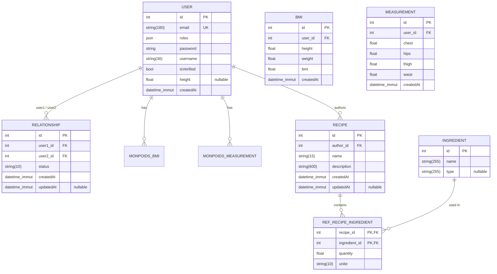

# MesApplisHF

A Symfony 8 application skeleton powering the **HF apps portal**.

It hosts a collection of small personal apps. The first one shipped is **MonPoids** — a weight & body-measurement tracker with a BMI calculator.

> Status: early development.

---

## Tech stack

| Layer       | Choice                          |
| ----------- | ------------------------------- |
| Language    | PHP **8.4+**                    |
| Framework   | Symfony **8.0.\***              |
| Runtime     | `symfony/runtime`               |
| Dependency  | Composer (managed via Flex)     |
| Autoloading | PSR-4 — `App\` → `src/`         |

## Requirements

- PHP **>= 8.4** with `ext-ctype` and `ext-iconv`
- [Composer](https://getcomposer.org/) 2.x
- (Optional) the [Symfony CLI](https://symfony.com/download) for the local web server

## Getting started

```bash
# 1. Clone
git clone <repo-url> MesApplisHF
cd MesApplisHF

# 2. Install dependencies
composer install

# 3. Configure environment
cp .env .env.local      # then edit .env.local

# 4. Run the dev server
symfony serve -d        # http://127.0.0.1:8000
# — or, without the Symfony CLI:
php -S 127.0.0.1:8000 -t public
```

## Project layout

```
.
├── bin/console        # Symfony console entry point
├── config/            # Bundles, routes, packages config
│   ├── packages/      # cache, framework, routing
│   └── routes/        # route definitions
├── public/            # Web root — index.php front controller
├── src/
│   ├── Controller/    # HTTP controllers
│   ├── Entity/        # Doctrine entities (see "Database schema" below)
│   │   └── MonPoids/  # MonPoids app — Bmi, Measurement
│   ├── Repository/    # Doctrine repositories
│   └── Kernel.php     # Micro-kernel
├── composer.json
└── symfony.lock
```

## Database schema



> Table and column names follow Doctrine's default snake-case mapping. The `user` table is quoted (`` `user` ``) because it's a reserved keyword on most engines.

## Common commands

```bash
php bin/console list                # all available commands
php bin/console debug:router        # registered routes
php bin/console cache:clear         # clear the cache
php bin/console about               # environment summary
```

## Adding a controller

```bash
composer require symfony/maker-bundle --dev
php bin/console make:controller HelloController
```

## License

Proprietary — all rights reserved.
